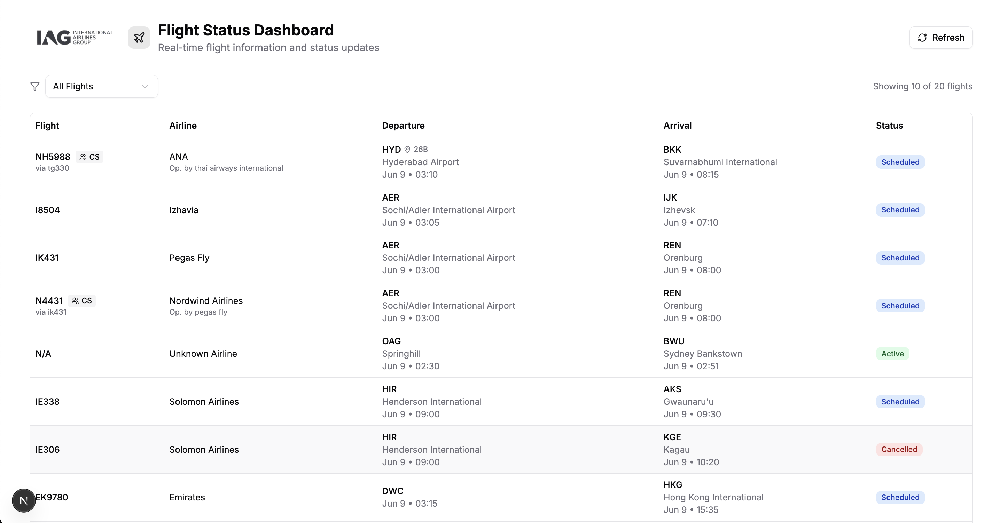

# Flight Schedule Frontend



This is the **frontend web application** for the Flight Schedule/Aviation Log platform.It provides a modern, responsive interface for browsing live flight data, analyzing real aircraft maintenance logs, and visualizing insights powered by AI.

---

## Technologies Used

- **Next.js** – React-based framework for production web apps, SSR, and static export.
- **React** – UI library for component-based web development.
- **TypeScript** – Typed superset of JavaScript for robust code.
- **Tailwind CSS** – Utility-first CSS framework for rapid, responsive design.
- **shadcn/ui** – Modern UI component library.
- **Playwright** – End-to-end testing framework for UI and integration tests.
- **Jest** – Unit testing framework for JavaScript/TypeScript.
- **Fetch API** – Used to interact with backend endpoints.
- **Vercel** – Recommended for serverless deployment and preview environments.

---

## Features

- **Live Flight Search:**  
  View live flight information pulled from the backend (AviationStack API).
- **AI Log Analyzer:**  
  Analyze real maintenance logs using OpenAI’s GPT, with a simple UI for selection and summary.
- **Pagination & Filtering:**  
  Easily browse paginated data and filter as needed.
- **Modern UX:**  
  Responsive tables, alerts, and smooth loading states.
- **Real Aviation Logs:**  
  Demo data sourced from the MaintNet dataset for real-world relevance.

---

## Environment Variables

Create a `.env.local` file in your project root:

```env
NEXT_PUBLIC_API_BASE=https://your-backend-api-url/Prod
```

**Quick Start:**

```sh
# Install dependencies
npm install

# Run in development mode
npm run dev
```

**Test:**

```sh
# Unit Tests (Jest):
npm run test:unit

# Run in development mode
npm run test:e2e
```
